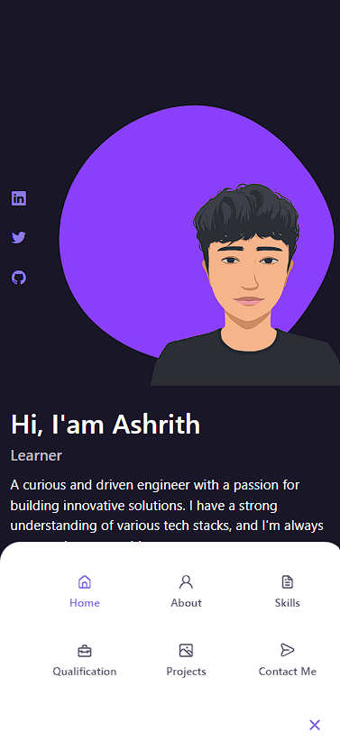
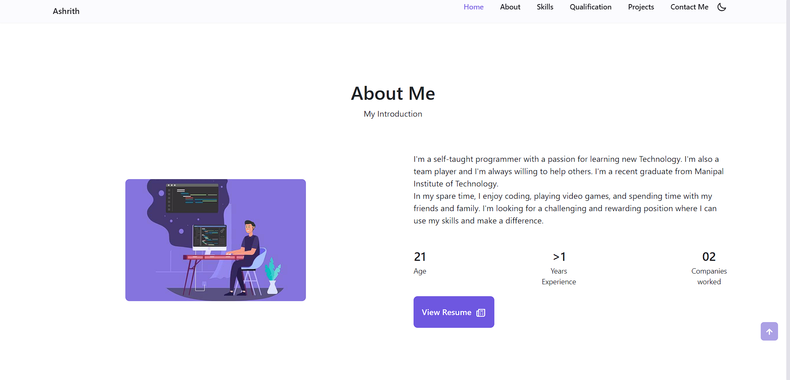

<h1>Portfolio Website</h1>
This repository contains the code for my personal portfolio website. The website is built using HTML, CSS, Bootstrap, and JS.

<h2>Features</h2>
<ul>
<li>The website features a responsive design that works well on all devices.</li>
<li>The website is easy to navigate and provides a clear overview of my skills and experience.</li>
<li>The website includes a functioning form.</li>
<li>The website includes light and dark themes.</li>
<li>The website is hosted on GitHub Pages.</li>
<li>Easy to change the theme of the website.</li>
</ul>
<h3>Overview</h3>

<h3>Getting Started</h3>
To view the website, you can clone the repository and open the <code>index.html</code> file in a web browser.

<h3>To contribute</h3>
If you would like to contribute to the website, please fork the repository and submit a pull request.

<h3>Contact</h3>
If you have any questions or feedback, please feel free to contact me!.

<b>Thanks for visiting!<b> 

Unicons by <a href="https://iconscout.com/">IconScout</a> 
Forms by <a href="https://formspree.io/">Formspree</a> 
Avatar Design by <b><i>Rusne Dapkevičiūtė</i><b>:mage_woman:
 
<a href="https://ashhh-01.github.io/Portfolio/">Portfolio</a>
